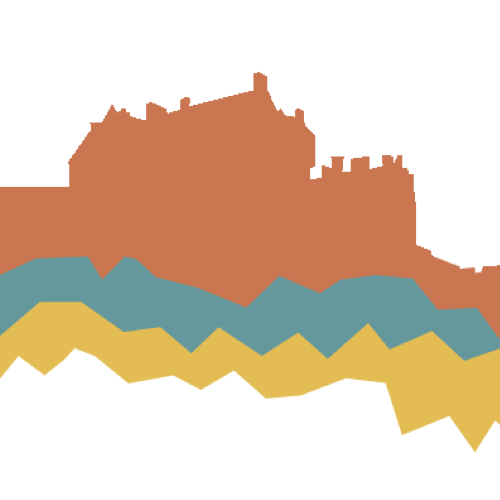

{.profile-pic fig-alt="logo, a simple graph resembling Edinburgh skyline" fig-align="center" width="33%"}

Here you will find some useful information about the team

TODO, some description with links to [about](about.qmd),  [people](people.qmd),  [resources](resources.qmd),  [teaching](teaching.qmd)

TODO: interesting way to include link? in R:

`r icon_link(
  icon = "globe",
  text = "website",
  url = "https://www.pairprogramming.ed.ac.uk"
)`

# [ABOUT]{.second-color}
Get to know our DDI Talent team and the different teaching activities. 