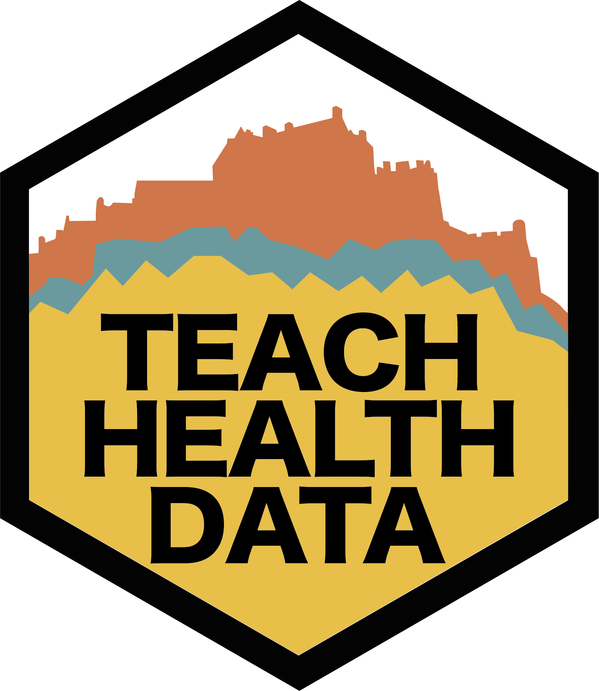

---
knitr:
  opts_chunk: 
    collapse: false
execute: 
  echo: false
page-layout: full
include-in-header: 
  - _includes/fontawesome-2up.html
title: "Data Science for Health and Social Care at the University of Edinburgh"
listing:
  - id: menu-items
    contents:
    - "people.qmd"
    - "resources.qmd"
    - "teaching.qmd"
    sort: falsex
    type: grid
format:
  html: 
    css: ddi-styles.css
---
::: {.profile-image-float-left .profile-image-float-left-small}

:::

#### We are the team delivering Data Science for Health and Social Care courses within Edinburgh Medical School (University of Edinburgh). Here you will find information about our courses, about us and resources we're creating.

:::{#menu-items .float-none}
:::

