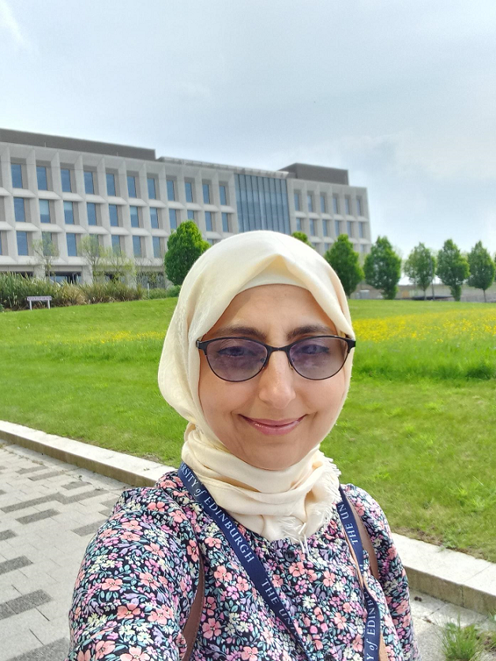

{fig-align="left" width="239"}

## **Job**

Currently, I have been a [teaching assistant](https://www.research.ed.ac.uk/en/persons/laila-dabab-nahas/) at Edinburgh Medical School since May 2024.

## **About me**

I love programming, teaching and research. I studied things related to biotechnology- a bachelor's and MSc in biotechnology- in addition to programming and research- PhD and postdoctoral in bioinformatics. I am lucky to be able to practice all of them throughout my study and work which is really cool!

## Experience

-   [High performance computers (Eddie)](https://information-services.ed.ac.uk/research-support/research-computing/ecdf/high-performance-computing)

-   Programming languages: Shell, R, SQL, NLP, Python

-   Websites development

-   [GitHub](https://github.com/LailaNh)

-   Analysis such as scRNA, RNA and HiC.

## Courses I teach in

-   Data Sciences for Health and Social Care

-   Foundational and Applied Research Design courses

-   Introduction to Databases and information systems

-   Natural Language Processing (NLP) in Health and Social Care

-   Foundations of software development in Health and Social Care

-   In addition to a lot of other courses I support such as the AI for Care in The Degital of Age

## CPD

-   AFHEA

-   PGCap in progress ..

## Cool ideas

[Escape room](https://www.thinglink.com/view/scene/2020543706418905956) for teaching in Foundation Research Design

## Supervision and Research

-   Co-supervising a GWAS project for PG with Dr. Kristin Nicodemus

-   Co-supervising a SLICC project with Dr. Nadege Atkins

-   A mentor in [Education Beyond Borders programme](https://global.ed.ac.uk/education-beyond-borders) at The University of Edinburgh

## Publications

[Laila Dabab Nahas - Google Scholar](https://scholar.google.com/citations?user=ulTslo4AAAAJ&hl=en)

Participating in two chapters in a coming book..

## Outside work

-   A very proud mother

-   Manges here own small business, [Ibn Battuta Arabic online centre](https://ibn-battuta.co.uk/Eng.html) for teaching Arabic for children and adults

-   A volunteer in [Home-Start East Lothian](https://homestarteastlothian.co.uk/)

-   Started to learn playing piano recently!

-   Loves reading books (such as "Atomic Habits" by James Clark and "That little sound in your head" by Mo Gawdat) and socializing

-   Loves to learn new things

## Contact details

📧 [Laila.Dabab.Nahas\@ed.ac.uk](mailto://Laila.Dabab.Nahas@ed.ac.uk)

📧 [lailanhass\@hotmail.com](http://lailanhass@hotmail.com)

🔗 [LinkedIn](https://www.linkedin.com/in/lailadababnahas/)
