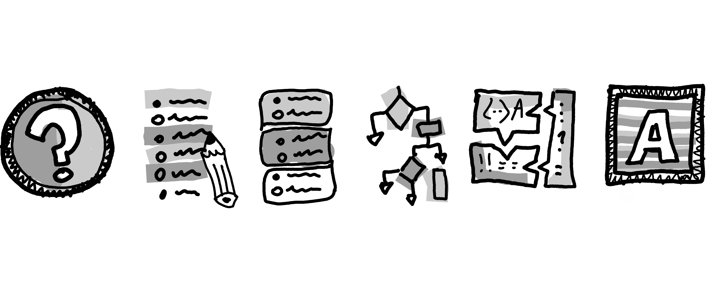

{.profile-pic fig-alt="TODO" fig-align="center" width="33%"}

# [RESOURCES]{.second-color}
We love sharing our innovative learning in our books, software tools and videos. Read about innitiatives and resoutces we created to enable other educators and learners to flourish.